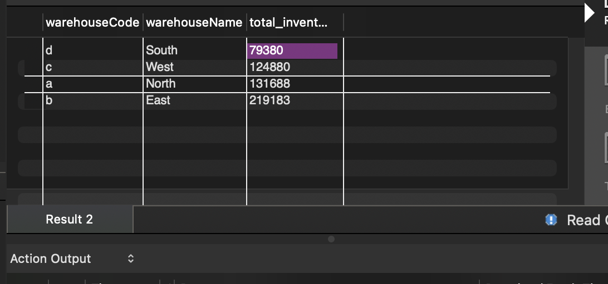
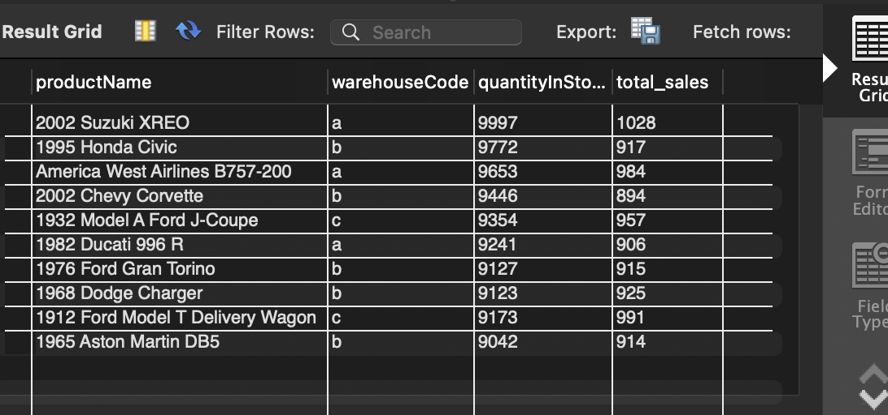
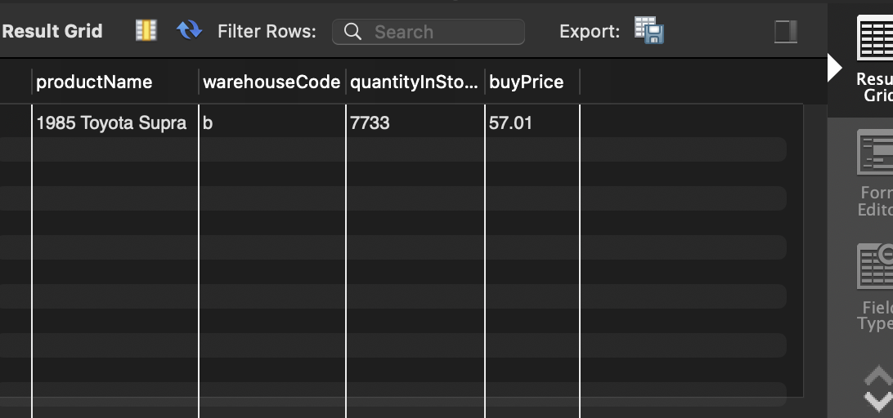

# Supply Chain Optimisation: Warehouse Consolidation & Inventory Rationalisation

---

This case study is based on a publicly available  Coursera dataset and prompt. The focus here is on analytical approach and decision reasoning.

---

## Project Overview
**Mint Classics**, a retailer of classic model cars, is facing high storage costs and looking to close one of its four storage facilities. 

In this case study, I analysed inventory and sales data using MySQL to determine:
1. Which facility can be closed with minimal impact.
2. How to reorganize the remaining inventory.
3. Opportunities to reduce "dead stock" to free up space.

## Key Findings

### 1. Warehouse Utilisation Analysis
After querying the total inventory per facility, I identified **Warehouse South** as the prime candidate for closure.
* **Warehouse South** currently holds 79,380 units, the lowest volume of all facilities (≈36% of Warehouse East, the largest facility at 219,183 units).

### 2. Inventory vs. Sales (Overstock Indicators)
Comparing quantityInStock against quantityOrdered surfaced systemic overstocking patterns across the portfolio
* **Example:** The *2002 Suzuki XREO* has **9,997 units** in stock but has only sold **1,028 units** in its entire lifecycle.
* The top 10 overstocked items alone account for nearly **90,000** units of stagnant inventory. Drastically reducing these stock levels would free up more than enough space to accommodate the inventory transfer from Warehouse South.

### 3. "Dead Stock" Identification
I isolated products that have generated $0 in revenue (zero sales history).
* **Major Finding:** The *1985 Toyota Supra* has **7,733 units** sitting in Warehouse East.
* **Financial Impact:** With a buy price of **$57.01**, this single item represents roughly **$440,000** in tied-up capital that is generating no return. This represents both a storage cost burden and an opportunity cost in redeployable working capital

---

## Recommendations

Based on the SQL analysis, I propose the following roadmap for Mint Classics:

1.  **Close Warehouse South**: Redistribute its ~79k units across the remaining three facilities.
2.	**Liquidate Dead Stock**: Immediately liquidate or scrap the 7,733 units of the 1985 Toyota Supra to free capacity in Warehouse East.
3.	**Rebalance Inventory Policy**: Pause reordering of the top 10 slow-moving items (e.g., Suzuki XREO) until stock levels align with demand trends.

---

## Technical Skills Used
* **SQL Dialect:** MySQL
* **Joins:** `INNER JOIN` (connecting products to warehouses), `LEFT JOIN` (identifying null sales).
* **Aggregations:** `SUM()`, `COUNT()` to calculate total inventory and sales volume.
* **Logic:** Filtering with `WHERE IS NULL` to find dead stock; Sorting with `ORDER BY` to rank warehouse capacity.
* **Data Modeling:** Reverse-engineered the database schema to understand entity relationships and query paths.

Assumptions & Limitations
- Analysis assumes historical sales trends are indicative of near-term demand.
- Liquidation feasibility and pricing impacts were not modelled.
- Operational constraints (transfer costs, warehouse capacity limits) were inferred from inventory volume rather than physical layout.

## Repository Structure
* `analysis_queries.sql`: The raw SQL script containing the three major analytical queries.
* `mintclassics_database_setup.sql`: The source data file to recreate the database.
* `ER_Diagram.png`: The Entity Relationship Diagram showing the database schema.
* `README.md`: This project summary.

## How to Run
1.  Import `mintclassics_database_setup.sql` into your local MySQL Server to create the database.
2.  Open `analysis_queries.sql` in MySQL Workbench.
3.  Execute the queries to reproduce the findings.
